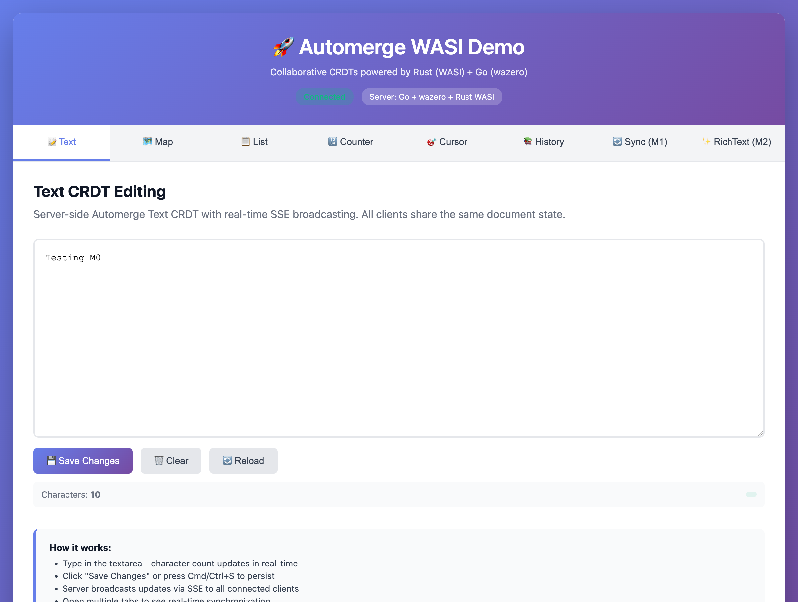
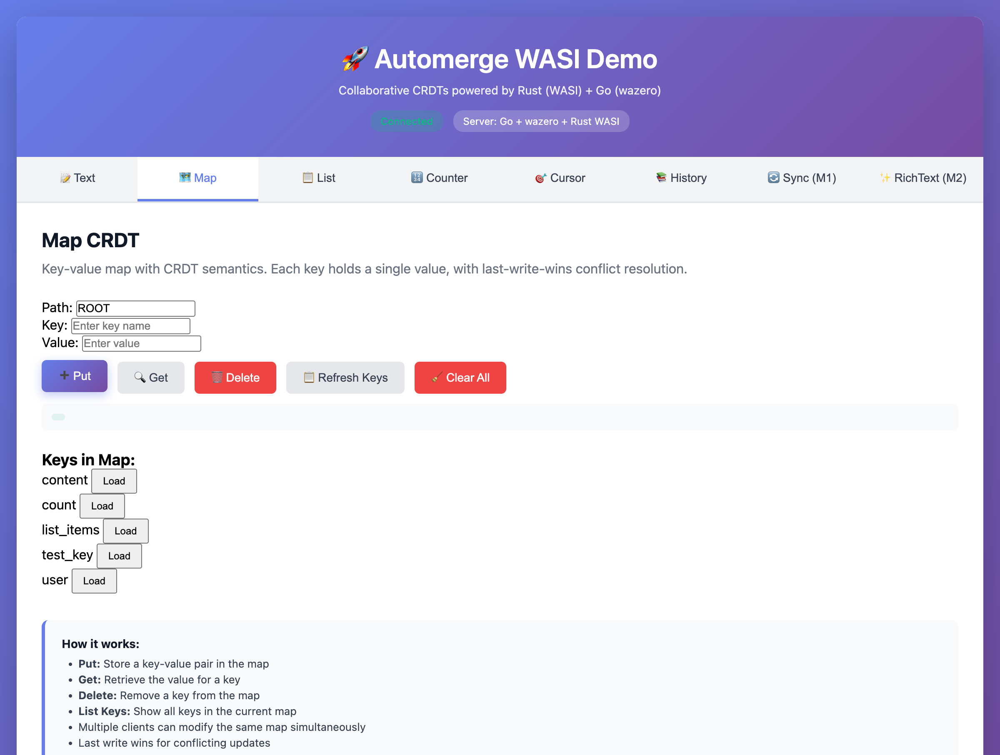
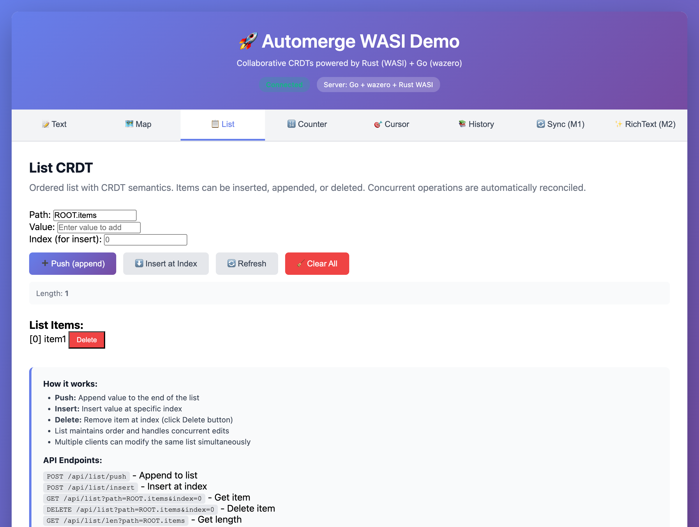
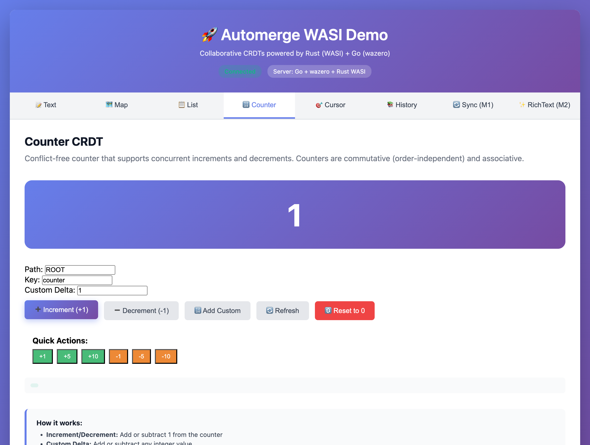
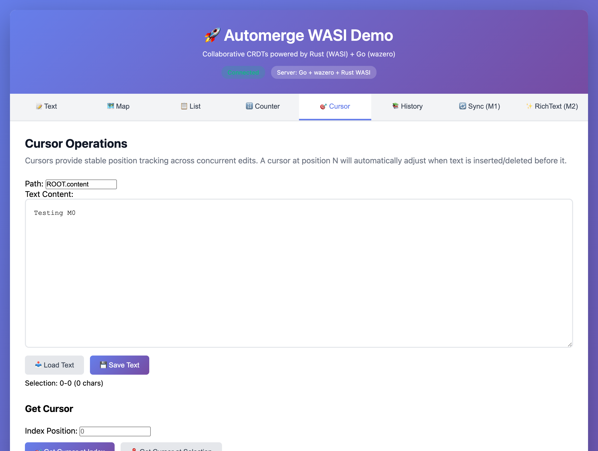
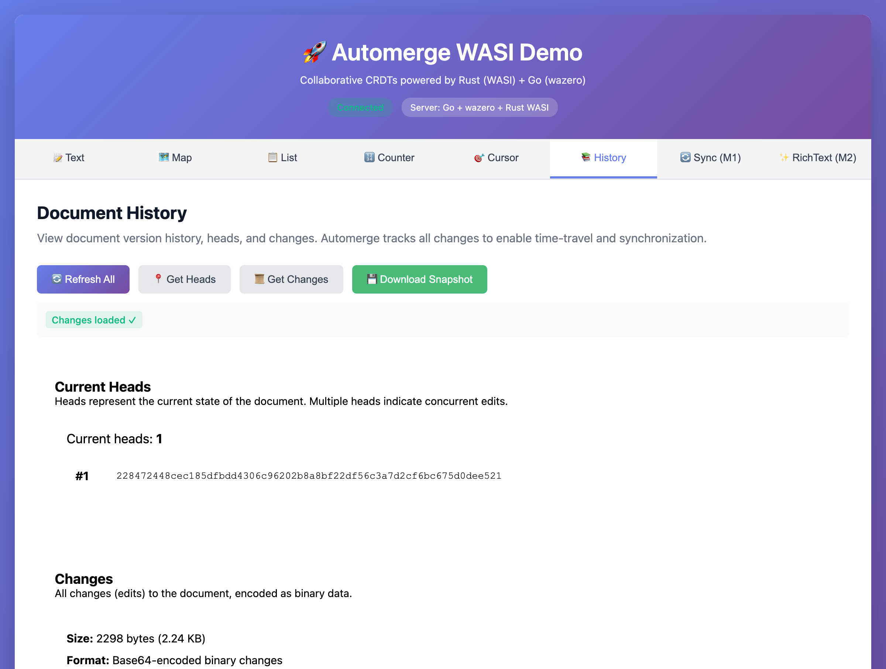

# Automerge + WASI + wazero: Complete CRDT Demo

**Production-ready collaborative CRDT demo** powered by Automerge (Rust), WASI, and wazero (Go).

## Why This Matters

**Build truly collaborative apps without complex backend infrastructure.** This project solves the hardest problems in distributed systems:

- **✅ No conflict resolution logic** - CRDTs mathematically guarantee consistency
- **✅ Offline-first by default** - Work disconnected, sync seamlessly when reconnected
- **✅ Local-first architecture** - Data stays on your device, no cloud dependency
- **✅ Cross-platform from one codebase** - Desktop, mobile, and web from the same Go server
- **✅ Real-time collaboration** - Like Google Docs, but you control the infrastructure

**Perfect for:**
- 📱 Mobile apps that need offline capability
- 🎮 Real-time multiplayer experiences
- 📝 Collaborative editing tools
- 🏥 Healthcare/field apps with intermittent connectivity
- 🔐 Privacy-focused apps where data stays local

### How It Works: CRDTs Handle the Hard Part

**Core Architecture:**
- **CRDTs handle data merge** - Automerge automatically merges changes without conflicts
- **Any transport works** - HTTP, WebSockets, Bluetooth, files on USB drives... it doesn't matter!
- **Great with NATS** - Pair with [NATS](https://nats.io) for lightweight pub/sub signaling (separate project)

```
Device A makes changes ──> Automerge CRDT state
                                │
                                ├──> Share via ANY transport ──> Device B
                                │    (NATS, HTTP, files, etc.)
                                │
                                └──> Automerge merges changes
                                     ✅ Guaranteed consistency
```

**Why this matters:** Traditional sync needs complex operational transforms, vector clocks, or central coordination. CRDTs just need to exchange state - the math guarantees consistency regardless of network timing or failures. You could use HTTP polling, WebSockets, file sharing, or pair with [NATS](https://nats.io) for real-time pub/sub signaling. Each device runs its own local Go server with embedded CRDT state.

**The Stack:** This project demonstrates running [Automerge](https://automerge.org) - a mature CRDT library - compiled to WebAssembly (WASI) and hosted in a Go server using [wazero](https://wazero.io). Features a complete web UI showcasing **8 different CRDT types** with real-time collaboration via Server-Sent Events (SSE).

[](LICENSE)
[](https://go.dev)
[](https://www.rust-lang.org)

---

## 🎯 Live Demo

After running `make run`, open **http://localhost:8080** to see all 8 CRDT types in action:

### 📝 Text CRDT
Basic collaborative text editing with character count and real-time sync.



### 🗺️ Map CRDT
Key-value storage with CRDT conflict resolution. Put, get, delete, and list keys.



### 📋 List CRDT
Ordered list with CRDT semantics. Push, insert at index, and delete operations.



### 🔢 Counter CRDT
Conflict-free counter with increment/decrement. Features animated display and quick action buttons.



### 🎯 Cursor Operations
Stable position tracking across concurrent edits. Interactive demo shows cursor adjusting as text changes.



### 📚 Document History
View version history, heads (DAG tips), and changes. Download `.am` snapshots for offline storage.



Plus **🔄 Sync Protocol (M1)** and **✨ Rich Text (M2)** tabs!

---

## 🚀 Quick Start

### Prerequisites

- **Rust** (stable): Install via [rustup](https://rustup.rs/)
- **Go** 1.21+: [Download Go](https://go.dev/dl/)
- **Make**: Usually pre-installed on macOS/Linux

### Installation & Run

```bash
# Clone the repository
git clone https://github.com/joeblew999/automerge-wazero-example.git
cd automerge-wazero-example

# Build and run (builds WASI module + starts server)
make run
```

The server will start on **http://localhost:8080** 🎉

Open multiple browser tabs to see real-time collaboration!

---

## 🏗️ Architecture

Perfect **1:1 mapping** across 6 layers - every file has an exact counterpart in each layer:

```
Web UI → HTTP API → Go Server → Go API → Go FFI → Rust WASI → Automerge Core
(*.js)   (api/*.go)  (server/*) (automerge/*)(wazero/*)(*.rs)
```

**Key Stats**:
- 🎯 **57 WASI exports** covering ~80% of Automerge API
- 🔒 **13 modules** with perfect 1:1 file mapping
- 🧪 **103+ tests** (36 Rust + 67+ Go), all passing
- 📦 **Binary persistence** with `.am` snapshots
- 🔄 **Real-time SSE** broadcasts to all clients
- 🌐 **8-tab web UI** with gradient design

---

## 📊 Complete Feature Matrix

| Feature | WASI Exports | Go API | HTTP | Web UI | Status |
|---------|--------------|--------|------|--------|--------|
| **Text** | 4/4 | ✅ | ✅ | ✅ | 100% |
| **Map** | 6/6 | ✅ | ✅ | ✅ | 100% |
| **List** | 8/8 | ✅ | ✅ | ✅ | 100% |
| **Counter** | 3/3 | ✅ | ✅ | ✅ | 100% |
| **Cursor** | 3/3 | ✅ | ✅ | ✅ | 100% |
| **History** | 4/4 | ✅ | ✅ | ✅ | 100% |
| **Sync** | 5/5 | ✅ | ✅ | ✅ | 100% |
| **RichText** | 7/7 | ✅ | ✅ | ✅ | 100% |

**Total**: 57/57 WASI exports implemented!

---

## 🌐 HTTP API Examples

### Text Operations
```bash
curl http://localhost:8080/api/text
curl -X POST http://localhost:8080/api/text -H 'Content-Type: application/json' -d '{"text":"Hello!"}'
```

### Map Operations
```bash
curl -X POST http://localhost:8080/api/map -d '{"path":"ROOT","key":"user","value":"Alice"}'
curl "http://localhost:8080/api/map?path=ROOT&key=user"
curl "http://localhost:8080/api/map/keys?path=ROOT"
```

### Counter Operations
```bash
curl -X POST http://localhost:8080/api/counter -d '{"path":"ROOT","key":"clicks","delta":1}'
curl "http://localhost:8080/api/counter?path=ROOT&key=clicks"
```

**23 HTTP endpoints** total - see [HTTP API Complete Guide](docs/reference/http-api-complete.md)

---

## 📁 Project Structure

```
.
├── Makefile                # Build automation + tests
├── CLAUDE.md               # AI agent instructions
├── README.md               # This file
│
├── go/                     # Go server
│   ├── cmd/server/         # HTTP server (23 routes)
│   └── pkg/
│       ├── automerge/      # High-level API (13 files)
│       ├── server/         # Server layer (13 files)  
│       ├── api/            # HTTP handlers (13 files)
│       └── wazero/         # FFI wrappers (13 files)
│
├── rust/automerge_wasi/    # Rust WASI module
│   └── src/                # 13 modules (1:1 with Go)
│
├── web/                    # Modern web UI
│   ├── index.html          # Tab navigation
│   ├── js/                 # 8 component modules
│   └── components/         # 8 HTML templates
│
├── docs/                   # Comprehensive docs
│   ├── tutorials/          # Getting started
│   ├── how-to/             # Recipes
│   ├── reference/          # API docs
│   └── development/        # Testing, roadmap
│
└── screenshots/            # Component screenshots
```

---

## 🧪 Testing

```bash
make test-go        # 67+ Go tests ✅
make test-rust      # 36 Rust tests ✅
make verify-web     # Web structure ✅
make verify-docs    # Doc links ✅
```

All tests passing! See [Testing Guide](docs/development/testing.md)

---

## 📚 Documentation

- **[Getting Started](docs/tutorials/getting-started.md)** - Tutorial
- **[Architecture](docs/explanation/architecture.md)** - Deep dive
- **[API Reference](docs/reference/api-mapping.md)** - Complete API
- **[Testing](docs/development/testing.md)** - Test guide
- **[STATUS](STATUS.md)** - Project status and future plans

**[📚 Full Documentation Index →](docs/README.md)**

---

## 🚦 Commands

```bash
make build-wasi      # Build Rust WASI
make run             # Build + start server
make test-go         # Run Go tests
make test-rust       # Run Rust tests
make clean           # Clean artifacts
```

---

## 🔮 Status

- ✅ **M0**: Core CRDTs (Text, Map, List, Counter, Cursor, History)
- ✅ **M1**: Sync protocol (delta-based sync)
- ✅ **M2**: Rich text (marks/spans)
- ✅ **Web UI**: All 8 components with screenshots
- 🚧 **M3**: NATS transport (planned)
- 🚧 **M4**: Datastar UI (planned)

---

## 🔗 Links

- [Automerge](https://automerge.org) - CRDT library
- [wazero](https://wazero.io) - Go WASM runtime
- [WASI](https://wasi.dev) - WebAssembly System Interface
- [NATS](https://nats.io) - Messaging system (great transport partner)

---

## 🤝 Collaboration

This project is part of a larger local-first architecture combining:
- **Automerge CRDTs** (this repo) - Conflict-free data layer
- **NATS** - Lightweight messaging and sync signaling
- **Datastar** - Reactive UI components
- **[goup-util](https://github.com/joeblew999/goup-util)** - Cross-platform app bundling (iOS, Android, macOS, Windows, Linux)
- **[wellknown](https://github.com/joeblew999/wellknown)** - Data sovereignty and platform-agnostic publishing

**Complete Stack = Own Your Data, Reach Everyone:**
- **Write once** → HTML/CSS/JS deploys to mobile, desktop, and web
- **Own your data** → CRDTs sync locally, you control the infrastructure
- **Publish optionally** → Use wellknown URIs to route to your apps or mirror to Google/Apple services
- **Stay portable** → Your links work regardless of which platforms you use
- ~95% web tech, ~4% Go backend, ~1% build commands

**Looking for partners and organizations** interested in:
- Building local-first applications
- Offline-capable mobile/desktop solutions
- Privacy-focused collaborative tools
- Edge computing and distributed systems

Open to collaboration, consulting, and commercial partnerships. Reach out via [GitHub Issues](https://github.com/joeblew999/automerge-wazero-example/issues) or explore the codebase to see if it fits your needs.

---

## 📄 License

MIT License - See [LICENSE](LICENSE)

---

**Built with ❤️ using Rust, Go, and WebAssembly**

*Perfect 1:1 mapping across 6 layers with 103+ passing tests*
