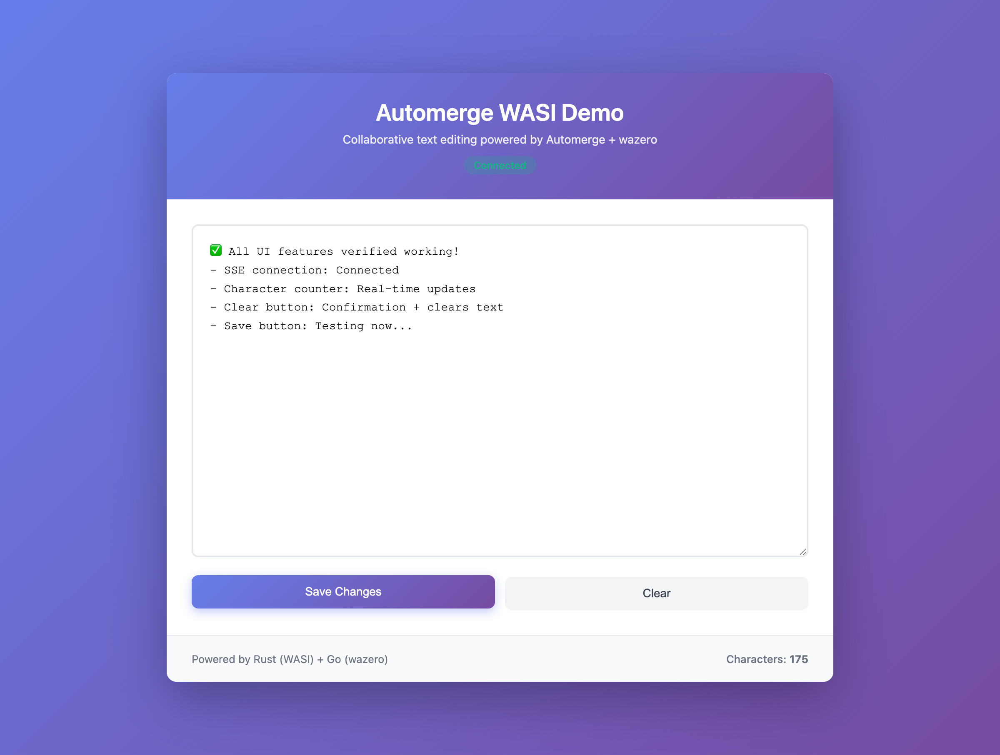

# automerge-wazero-example

**Collaborative text editing demo** powered by Automerge (Rust), WASI, and wazero (Go).

This prototype demonstrates running [Automerge](https://automerge.org) CRDT compiled to WebAssembly (WASI) and hosted in a Go server using [wazero](https://wazero.io). Real-time collaborative editing is enabled via Server-Sent Events (SSE).

## Screenshot


*Screenshot of the collaborative text editor interface with purple gradient background, text area, and real-time status indicator*

## Architecture

- **Rust WASI module**: Wraps Automerge core with C-like ABI exports
- **Go server**: Uses wazero to host the WASM module, provides HTTP API + SSE
- **Web UI**: Simple textarea editor with real-time collaborative updates
- **Persistence**: Automatic snapshot saves to `doc.am`

## Prerequisites

- **Rust** (stable): Install via [rustup](https://rustup.rs/)
- **Go** 1.21+: [Download Go](https://go.dev/dl/)
- **Make**: Usually pre-installed on macOS/Linux

## Quick Start

```bash
# Clone the repository
git clone https://github.com/joeblew999/automerge-wazero-example.git
cd automerge-wazero-example

# Build and run (builds WASI module + starts server)
make run
```

The server will start on **http://localhost:8080**

Open your browser to http://localhost:8080 to see the collaborative text editor!

## Available Commands

```bash
# Build the Rust WASI module only
make build-wasi

# Run the server (builds WASI module first)
make run

# Tidy Go modules
make tidy

# Clean build artifacts
make clean

# Clean snapshot files
make clean-snapshots
```

## HTTP API

The server exposes these endpoints:

- `GET /` - Web UI
- `GET /api/text` - Get current document text (text/plain)
- `POST /api/text` - Update document text (JSON: `{"text":"..."}`)
- `GET /api/stream` - Server-Sent Events stream for real-time updates

### Example API Usage

```bash
# Get current text
curl http://localhost:8080/api/text

# Update text
curl -X POST http://localhost:8080/api/text \
  -H 'Content-Type: application/json' \
  -d '{"text":"Hello Automerge!"}'

# Stream updates (SSE)
curl http://localhost:8080/api/stream
```

## How It Works

1. **Rust**: Automerge CRDT library compiled to `wasm32-wasip1` target
2. **WASI ABI**: C-like exports for memory management, text operations, and persistence
3. **Go + wazero**: Loads WASM module, calls exported functions via FFI
4. **HTTP + SSE**: REST API for text operations, SSE for broadcasting updates
5. **Browser UI**: Connects via SSE, sends updates via POST, displays real-time changes

## Project Structure

```
.
├── Makefile              # Build automation
├── CLAUDE.md             # Detailed implementation guide
├── go/
│   └── cmd/server/
│       ├── main.go       # Go server with wazero
│       └── go.mod        # Go dependencies
├── rust/
│   └── automerge_wasi/
│       ├── Cargo.toml    # Rust dependencies
│       └── src/
│           └── lib.rs    # Automerge WASI wrapper
└── ui/
    └── ui.html           # Web interface
```

## Development

See [CLAUDE.md](CLAUDE.md) for detailed documentation on:
- WASI ABI specification
- Development workflow
- Testing procedures
- Future roadmap (sync protocol, multi-doc, NATS, etc.)

## Links

- [Automerge](https://automerge.org) - CRDT library
- [Automerge GitHub](https://github.com/automerge/automerge)
- [wazero](https://wazero.io) - WebAssembly runtime for Go
- [WASI](https://wasi.dev) - WebAssembly System Interface

## License

See [LICENSE](LICENSE)
